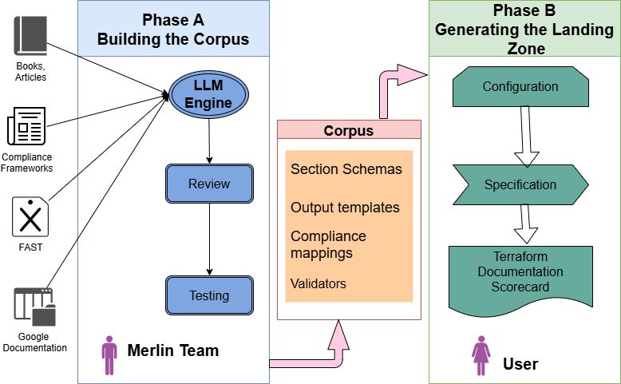
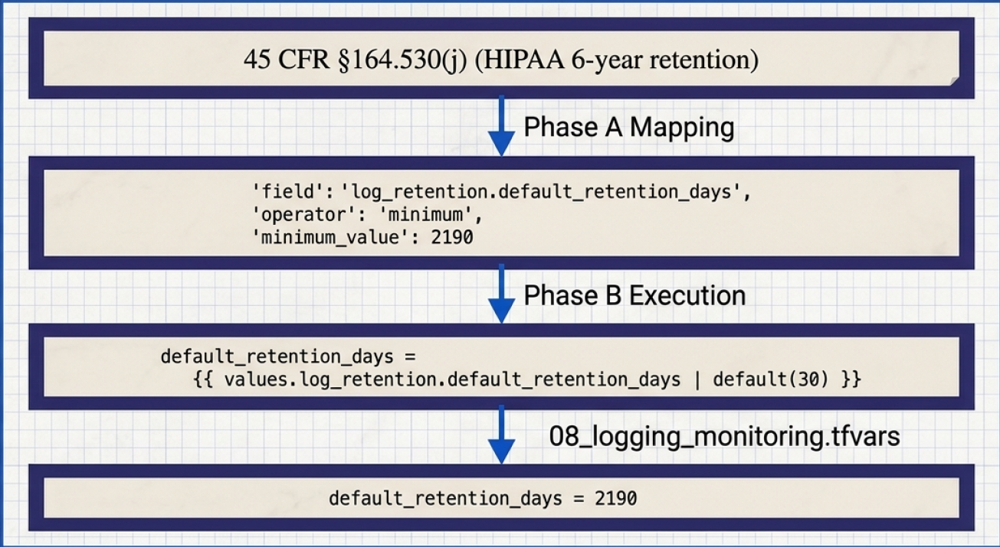

# Compiled AI for GCP Landing Zones

*How LLM-authored templates and deterministic generators replace runtime guesswork in complicated cloud foundations.*

LLM is spreading into more and more areas of work, but there are several where it cannot produce content directly. These are bank regulatory filings, executed legal contracts, medical prescriptions, audit attestations, aerospace maintenance procedures, and so on. Such outputs must be reproducible from the same inputs and auditable to every value. The same requirements have to produce the same output, and any change in the output has to be explainable back to a change in the inputs.

A public cloud landing zone belongs to this group. The same business requirements, regulatory obligations and architectural decisions have to produce the same configuration. A configuration that drifts because of sampling temperature is not acceptable, and a landing zone is not an exception. It is the foundation a regulated business runs on.

Setting up a landing zone today typically consists of five steps:

1. Gathering business and technical requirements and constraints, including applicable regulations.
2. Selecting a reference architecture. It may be a similar project the team did recently, a public repository on GitHub, or a vendor blueprint. For GCP many teams use FAST; for AWS there are more options.
3. Making the parameter decisions: regions, VPC topology, key policy, IAM model, VPC-SC perimeters, DR pairings, and so on.
4. Writing or adapting the Terraform and YAML.
5. Validating and delivering. An iterative process, from syntax validation with `terraform plan` to deep analysis of how the LZ aligns with the requirements.

Steps 1 and 3 are architects’ job. They need deep understanding of the company’s target and limitations, knowledge in public cloud foundation, architectural thinking. Usually these processes go through a series of discussions with colleagues and stakeholders. Steps 2, 4, 5 are less creative. They are mechanical, time-consuming, and frequently a source of mistakes that are hard to spot. Compile-time AI is aimed at the translation work. The judgment work stays with the architect.

One more thing worth saying before going further. Google’s own landing zone design documentation states that “this series does not specifically address compliance requirements from regulated industries such as financial services or healthcare.” The official guidance stops where regulated cloud foundations actually begin. This article describes how to close this gap.

**Phase A — building the corpus.** This is the job of Merlin’s product team, not of the architect. The LLM reads framework documents, FAST modules, GCP best-practice guides, and practitioner literature, and drafts structured corpus entries: schemas, compliance rules, Jinja templates, validators. Each entity is reviewed by a human and passes tests before becoming a part of the corpus. The corpus is versioned. Nothing in it is the LLM’s unreviewed output.

**Phase B — generating a landing zone.** This is pure architect work performed using the Merlin application at [app.merlin-studio.cloud](https://app.merlin-studio.cloud). The process consists of three steps: discovery — defining business and technical requirements; configuration — supplying technical parameters; and finally generation — creating Terraform, YAML, diagrams and the scorecard based on corpus entities. There is no LLM in the runtime. The worker container does not even have an API key to a model provider. The same spec and the same corpus version produce identical output.

The corpus is the boundary between the two phases. Phase A produces it. Phase B uses it.

The corpus contains several kinds of entities. The list below is the short version.



*The corpus is the boundary between the two phases. In Phase A, Merlin’s team feeds an LLM engine from books, compliance frameworks, FAST, and Google documentation, then reviews and tests its output into the corpus — section schemas, output templates, compliance mappings, validators. In Phase B, the architect turns configuration into a specification and then Terraform, documentation, and a scorecard, with no LLM in the loop.*

- **Section schemas.** JSON files that define what the architect can configure for one part of the landing zone — the fields, their types, and the defaults that kick in if the architect leaves them alone.
- **Output templates.** Jinja2 templates that produce the files the engine emits: Terraform variables, Mermaid architecture diagrams, operator-facing documentation.
- **Compliance mappings.** One JSON file per framework. Each file translates a regulatory regime into concrete spec requirements — allowed regions, restriction levels, rotation cadences, retention floors, and so on.
- **Validators.** Python code that checks the generated bundle for structural correctness, cross-section consistency, and operational readiness, and produces the weighted score the architect sees in the scorecard.

Phase A produces all of these. Phase B reads them. The LLM never runs at Phase B.

Let’s trace one rule from the source document to the rendered Terraform.

The source is HIPAA. Specifically, 45 CFR §164.530(j).

TL;DR in my own words: a covered entity has to keep its HIPAA-related documentation — written policies, procedures, operational records — for six years from the date of creation or the date the document was last in effect, whichever is later. Audit logs are part of that documentation, so the same six-year floor applies to them.

**Phase A.** The LLM is given the list of corpus topics Merlin tracks and asked to build the HIPAA mapping. It mines its training data, finds the text relevant to log retention, recognises that the matching Merlin field is `log_retention.default_retention_days`, converts six years to days (2190), and emits a JSON entry that fits the schema for compliance rules. A human reviewer reads the entry against the source paragraph: is the field path right, is 2190 the right number, did the LLM hallucinate any clause that isn’t in the regulation? Verification of the framework as a whole is performed end to end by Merlin’s team before the framework is released for use.

The entry that lands in `configuration/compliance_mappings/hipaa.json`:

```json
{
  "field": "log_retention.default_retention_days",
  "field_label": "Default Log Retention Period (Days)",
  "operator": "minimum",
  "minimum_value": 2190,
  "severity": "required",
  "rationale": "HIPAA requires 6-year retention of audit logs",
  "reference": "45 CFR 164.530(j)"
}
```



*One rule, end to end: 45 CFR §164.530(j) becomes a Phase A mapping (`log_retention.default_retention_days`, `minimum_value: 2190`), which the Phase B render writes into `08_logging_monitoring.tfvars` as `default_retention_days = 2190`.*

**Phase B.** An architect opens the wizard at [app.merlin-studio.cloud](https://app.merlin-studio.cloud) and ticks HIPAA in the compliance section. Three things then happen.

1. **Compliance preprocessor.** For each active framework, the preprocessor walks the rule entries and applies them to the spec. For this rule, `operator: minimum` with `minimum_value: 2190` means: write 2190 into the spec at `log_retention.default_retention_days`, unless the architect already set that field explicitly. After this pass the spec contains `default_retention_days = 2190`.
2. **Section parser.** Reshapes the spec into a flat dictionary that the template consumes. The retention value passes through unchanged.
3. **Template render.** The Jinja2 template for the logging section reads:

```jinja2

log_retention = {
  default_retention_days = {{ values.log_retention.default_retention_days | default(30) }}
  custom_buckets = {
    
    "{{ _lz_prefix }}-{{ bucket.name }}" = {
      retention_days = {{ bucket.retention_days }}
      locked = {{ bucket.locked | default(false) | lower }}
    }{{ "," if not loop.last }}
    
  }
}

```

The renderer evaluates the template against the parsed spec and emits this block into the generated `08_logging_monitoring.tfvars`:

```hcl
log_retention = {
  default_retention_days = 2190
  custom_buckets = {}
}
```

Three corpus artifacts contributed to that single block: the compliance mapping (which set 2190), the section schema (which defined the field), and the Jinja2 template (which laid out the HCL). Every link in the chain is a pure function of its inputs. Same wizard spec, same corpus version, same generated value, every time.

Official documents — compliance frameworks, Google’s best-practice guides, FAST blueprints — do not cover every parameter of a landing zone. There are decisions an architect has to make that no document prescribes: budget alarm thresholds, naming conventions, DR strategy tiers, and many smaller choices.

For these gaps, the LLM is the right tool: it mines its training data for the prevailing practice across vendor blogs, conference talks, FinOps and SRE literature, and the operational experience encoded in books and forums. It produces an entry against the same schema the compliance mappings use, with a default value that fits the conventional shape. A human reviewer judges whether the default is sensible for Merlin’s audience.

A small example. In `09_cost_management.json` the default starter budget is $1000 with alert thresholds at 50%, 80%, and 100% of current spend, plus 100% of forecasted spend:

```json
{
  "budget_amount": 1000,
  "alert_thresholds_percent": [
    {"percent": 50, "basis": "current"},
    {"percent": 80, "basis": "current"},
    {"percent": 100, "basis": "current"},
    {"percent": 100, "basis": "forecasted"}
  ]
}
```

Nothing in FedRAMP, HIPAA, or CIS prescribes these numbers. They are the conventional FinOps starter shape.

The entry that lands in the corpus looks no different from one derived from a regulation. The compliance preprocessor reads both the same way. Once the corpus is built, the question of where each value came from is a Phase A concern, settled before the architect opens the wizard.

Phase B is the part of Merlin a reader can verify themselves. The architect’s wizard session produces a single `spec.json` file: every choice from the discovery and configuration steps is captured there. Merlin’s worker takes that file plus the corpus — Jinja2 templates and Python code (generators, composers) — and produces the bundle. The claim is: same `spec.json`, same corpus version, identical output zip.

The mechanism is straightforward. The compliance preprocessor walks frameworks in their listed order and rule entries in their JSON-listed order. Section parsers are pure transformations of dicts. Generators and composers are pure Python: same input, same output. The Jinja2 environment is configured without any non-deterministic filters. The bundle assembler writes files into the zip in a fixed sorted order. There is no random sampling anywhere — there is no model in the loop. Sampling is what makes LLMs nondeterministic; Phase B has no LLM.

Anyone can verify this directly at [app.merlin-studio.cloud](https://app.merlin-studio.cloud), guest mode included. Every project keeps its configurations versioned. An architect can regenerate the artifacts as many times as they want and, as long as the configuration has not changed, will get the same bundle back. Step into the configuration, change one parameter, regenerate — the diff in the artifacts is exactly the consequence of that one change. Revert the parameter, regenerate again, and the original artifacts are back. The chain from input to output is fully traceable, in both directions.

The corpus is only as good as the team maintaining it. Phase A is real, ongoing work — new compliance frameworks, new GCP services, new best practices. What compile-time AI does is move that work to a place where humans can scrutinise it, and keep the architect’s session deterministic and reproducible.

The two-phase approach Merlin uses has been in the air for some time. Several companies have implemented variants of it. For example Stainless uses this kind of architecture in their official SDKs for OpenAI, Anthropic, and others: an LLM helps build the generator’s configuration, and the generator itself runs without an LLM invocation.

Recently, the approach got its theoretical grounding. A paper published April 2026 under the title *Compiled AI: Deterministic Code Generation for LLM-Based Workflow Automation* (arxiv 2604.05150) studies the architecture in the context of high-stakes enterprise workflows. The paper’s name for the pattern, Compiled AI, fits Merlin exactly, which is why I use it.

The interesting question for cloud foundations is not whether LLMs can help. They can. The question is where to put them. Merlin’s answer is: use LLM to build templates and rules; use deterministic pipelines to build the LZ artefacts.

Merlin is free at [app.merlin-studio.cloud](https://app.merlin-studio.cloud). I would be glad to discuss anything in the article that doesn’t sit right with you.
