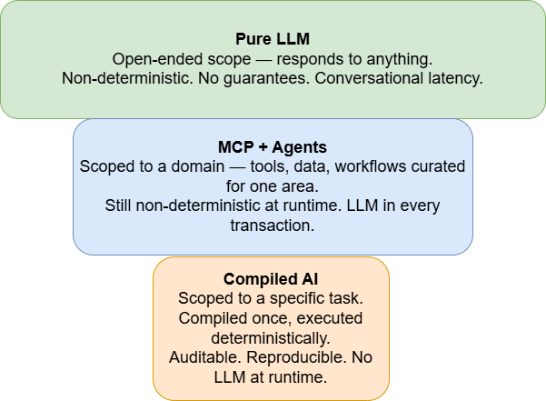
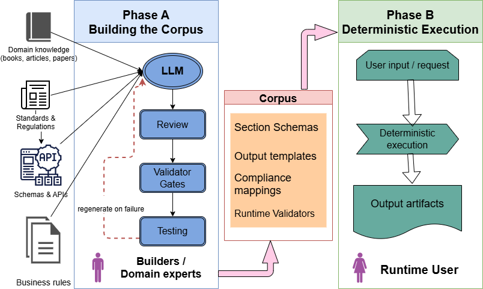
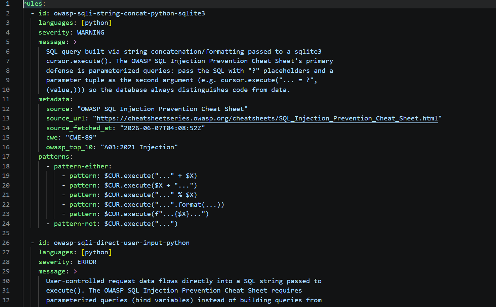

# Compiled AI: Engineering Deterministic LLM Systems

*Moving the LLM from runtime to compile time — and what to build around the corpus it produces.*

## 1. Why compiled AI

Today millions of people use LLM for work and leisure, and AI has become a part of our lives. But systematic use of LLMs in computer systems runs into difficulties — it turns out that LLMs know "all" except what you really need: no knowledge about your business processes, your rules, your data. MCP and agents came to resolve this problem by binding the LLM to information concerning your particular domain.

Another issue is inconsistency of LLM results. Yes, today you can ask AI to compose a poem or to suggest a medical diagnosis, but if you ask again you will likely receive a different poem and a different diagnosis. Compiled AI came to resolve this issue. It proposes the following paradigm: the LLM processes source information and transforms it into schemas (the corpus); runtime systems use the corpus to produce fully deterministic, traceable results. It's clear that you can't "compile" mass knowledge from different sources the way a pure LLM does — but for a wide set of specific tasks, this approach can really help.

Wider scope, weaker guarantees. The choice is which tradeoff fits your workflow.



*As scope narrows from Pure LLM to MCP + Agents to Compiled AI, determinism and guarantees increase: Compiled AI is scoped to a specific task, compiled once, then executed deterministically with no LLM at runtime.*

## 2. A Two-Phase Architecture

In this article we focus on a class of systems which cannot tolerate non-deterministic results. The architecture consists of two phases: Phase A — building the corpus (compile time); Phase B — using the corpus for deterministic execution. By corpus we mean the structured output of the compile phase — schemas, templates, generated code, validation rules — everything the deterministic runtime needs to execute the workflow. This is not a training corpus or a retrieval index; it is the compiled program.



*Phase A: LLMs draw on domain knowledge, standards, schemas/APIs, and business rules; builders and domain experts review, gate, and test the output, regenerating on failure until the corpus is trusted. Phase B: a deterministic runtime consumes the corpus to produce output artifacts — no LLM in the loop.*

The main actor of the compile phase is the LLM (in practice, several different LLMs). The LLMs draw on standards, documents, schemas, user data, and other structured and unstructured sources to build the structured artifacts the execution phase needs. These artifacts are schemas, templates, and code fragments — validators, composers, generators. Artifacts produced by LLMs can contain mistakes, be incomplete, or simply be wrong, so before using them we have to verify and test them. Once we trust the corpus, we treat its publication as a release — the same release process traditional software systems use. From then on, the deterministic system uses the corpus — often with a human operator involved — for ongoing operation.

Running a Compiled AI system depends largely on the particular system, but there are two issues common to the entire class.

**1) Contradictions between parts of the corpus.**

Because a system receives information from different sources, very often the same corpus item ends up with different values. On its own this doesn't cause a problem — these values can live in the corpus "in peace" — but at runtime a situation can arise where two or more rules with contradictory requirements apply to the same element. For example, our system has to choose an encryption algorithm for some data: the general schema template says it should be method A, best practices recommend method B, regulatory documents require C, and a user wants D. Which one do we apply at runtime? We resolve this with a specific set of rules — for example, Python code, also part of the corpus — that sets the priorities of the different sources and decides which value is correct in this specific situation. We call it an overlapping mechanism.

**2) Runtime issues.**

Dealing with runtime bugs and issues rests on a basic Compiled AI feature: backtrace capability. For every element of the runtime result, we can say which corpus element (or elements) is responsible for that value. What happens next depends on the kind of issue. In many cases you'll meet an ordinary bug, like in any other system: a human mistake, a typo, wrong syntax, and so on. But there may also be cases where the wrong result was caused by the LLM's output, and you'll have to investigate using LLM tools.

## 3. Testing and Verification

Verifying and testing Compiled AI systems is fundamentally different from testing traditional software. Traditional testing by QA teams, based on test cases prepared in advance, probably won't work in most cases. For example, in our system we have to use legal documents — an LLM transforms the relevant parts into JSON schemas. For an LLM this is a trivial job, but how do we verify the results? Hire a team of lawyers to read through the results (and explain to them what JSON is)? Not really.

A practical way for verification and testing is to use another LLM. I'll propose the following methods:

- generate results from the same prompt by a few LLMs and compare the results;
- ask another LLM to verify the results against the sources;
- test the whole corpus against an end-to-end test suite of the system's operation.

Part of verification — for example, the syntax of schemas and templates — can be done manually or by simple scripts. It's worth doing if it fits the testing flow; otherwise this work, too, can be handed to an LLM.

Testing the whole corpus against an end-to-end suite is a more effective method but has obvious gaps. A substantial number of test cases have to cover all aspects of production operation. Again — what do we do with the results? How can we be sure the system took into account all requirements of some legal document and interpreted it correctly? This is impossible without invoking LLMs. So testing and verification of Compiled AI systems rests mostly on LLMs: one LLM verifying another.

Despite the fact that most of the grunt work in testing is performed by LLMs, the development team has a central role in verifying and testing a Compiled AI system. It starts with planning: sporadically running LLM queries and comparing results, with no defined goals or flow, never leads to a trusted system. Creating the test prompts and evaluating the responses is human work: only a person can decide whether an LLM's answer actually addresses the question, and determine the next step.

## 4. Maintenance

Like all software, Compiled AI systems need to be maintained: fixing bugs and issues, adding features, shipping new minor and major releases. But Compiled AI has an additional source of change and an additional thing to maintain: the corpus. If we used certain information sources during the compile phase, then during the system's operation we have to track all of them and promptly update the corpus. Note that while a product's releases can be planned years in advance, changes to the corpus have to be more or less synchronized with changes in the sources the corpus is based on. This is a hard constraint. You can't build a Compiled AI system on sources that change daily — such a system is impossible to maintain. Fortunately, many systems can be built on rarely-changing sources: company documentation, APIs, regulatory and other legal documents, and so on. The human part of this work is to track which of the used sources has a new version, evaluate the changes — especially their impact on the corpus — invoke LLMs as needed, and verify and test the new version of the corpus. So the corpus version won't always match the product version.

For testing the corpus's new version, we recommend a "golden test suite" method. The team selects one or more cases that already pass all required tests and uses them as a baseline for future product versions. If, after changes to the product, the golden suite produces different results, either the new version is incorrect — or the change was significant enough that the golden cases themselves need to be re-verified.

## 5. Examples

### General note

A short note about the Compiled AI examples. In these examples I want to show how Compiled AI may be implemented. Real systems are far more complicated — I'm deliberately keeping things simple in order to explain the approach, not to ship a production-ready product. Please look at the examples from this perspective. That said, I'd be happy to discuss any ideas about real Compiled AI implementations — leave a comment.

### Code Security Scan with extended rules set

**Problem:** Many companies use Semgrep products for security scanning their codebase. Standard sets of rules don't cover all sources of code vulnerabilities and do not include company specific experience and requirements.

**Sources:** Incident reports (free text), CVE descriptions, internal post-mortem documents, OWASP guidance, language-specific best practices.

**Runtime:** running Semgrep product with extended rule set (corpus) for company codebase.

**Building corpus:**

Example of a prompt:

```text
SYSTEM
You are a Semgrep rule generator. Your job is to convert prose security
guidance into valid Semgrep YAML rules that statically detect violations
of the guidance.

Output contract:
- Return ONLY valid Semgrep YAML. No prose, no explanations, no markdown fences.
- The output MUST validate against the Semgrep rule schema (rules: array
  with id, pattern or patterns, message, severity, languages, metadata).
- Use kebab-case for rule IDs, prefixed with the source: e.g.
  "owasp-sqli-string-concat-python".
- Every rule MUST include a metadata block with:
    source: "OWASP SQL Injection Prevention Cheat Sheet"
    source_url: <the URL you fetched>
    source_fetched_at: <ISO 8601 timestamp of fetch>
    cwe: <relevant CWE id>
    owasp_top_10: <relevant entry, e.g. "A03:2021 Injection">
- Generate one rule per (language, anti-pattern) combination. Cover
  Python, Java, and JavaScript / TypeScript at minimum. Add other
  languages only if the guidance clearly applies.
- For each language, target the common database libraries:
    Python: sqlite3, psycopg2, mysql.connector, pymysql
    Java: java.sql.Statement, JDBC
    JS/TS: pg, mysql, mysql2, sequelize raw, knex.raw
- Severity: ERROR for direct user-input-to-query flows; WARNING for
  string concatenation patterns where taint cannot be statically proven.
- Prefer Semgrep's `patterns:` block with `pattern` + `pattern-not` over
  a single `pattern:` when needed to reduce false positives.
- Do NOT invent CWE numbers or OWASP entries; if uncertain, omit the
  field rather than guess.

Output structure:
- Return a single YAML document with a top-level `rules:` array.
- The document MUST start with `rules:` as the first key (no surrounding
  wrapper object, no extra top-level keys).
- All rules generated from this source go into the same document.
- The output is intended to be saved as a single file named
  `owasp-sqli.yml` and consumed by Semgrep via:
    semgrep --config owasp-sqli.yml <code-path>

USER
Fetch the OWASP SQL Injection Prevention Cheat Sheet from:
https://cheatsheetseries.owasp.org/cheatsheets/SQL_Injection_Prevention_Cheat_Sheet.html
Generate Semgrep rules that detect violations of the guidance in that
document. Focus on the cheat sheet's primary defense recommendations
(parameterized queries, ORMs, stored procedures) and the anti-patterns
it warns against (string concatenation, dynamic SQL with user input,
escaping as a primary defense).
If you cannot fetch the URL, stop and report the failure rather than
producing rules from training-data recollection of the document.
```

Prompt results: On the picture is shown a fragment of a LLM response.



*A fragment of an LLM response: generated Semgrep rules for SQL-injection anti-patterns, each carrying `source`, `source_url`, `cwe`, and `owasp_top_10` metadata so every finding can be traced back to its guidance.*

This is a working prompt, you can try it in different LLMs. Take into account, LLMs make mistakes. Invoking this prompt in different LLMs will likely give you different results. Building a Compiled AI system means putting LLM outputs through a validation gauntlet — cross-checking across models, filtering invalid output, running the results against test cases — before anything enters the corpus. Generally, Compiled AI is about how to build a trusted corpus from untrusted LLM outputs.

### OPA Policy Agent

Many companies using Kubernetes defend their environment with OPA Gatekeeper, often starting from the open-source Gatekeeper Library. The library covers common admission rules. It doesn't cover your organization's own policies — and it shouldn't have to. That's where Compiled AI comes in: it takes your security team's plain-English policies and compiles them into Rego.

To illustrate how a corpus can be built, let's take two short controls from the CIS Kubernetes Benchmark:

**Policy 1 — No privileged containers** (CIS Kubernetes Benchmark v1.8, control 5.2.1):

Prose source (paraphrased): "Minimize the admission of privileged containers. Privileged containers can perform almost every action that can be performed directly on the host, severely undermining cluster security boundaries."

Rego output:

```rego
package kubernetes.admission

deny[msg] {
    input.request.kind.kind == "Pod"
    container := input.request.object.spec.containers[_]
    container.securityContext.privileged == true
    msg := sprintf(
        "Privileged container '%v' not allowed (CIS-5.2.1)",
        [container.name]
    )
}
```

**Policy 2 — Block `:latest` image tags** (operational hygiene, often cited alongside CIS):

Prose source: "Container images must be deployed using immutable tags. Images using the ':latest' tag or no tag at all must be rejected, since they prevent reproducible deployments and complicate rollback."

Rego output:

```rego
package kubernetes.admission

deny[msg] {
    input.request.kind.kind == "Pod"
    container := input.request.object.spec.containers[_]
    endswith(container.image, ":latest")
    msg := sprintf(
        "Container '%v' uses ':latest' tag (not allowed)",
        [container.name]
    )
}

deny[msg] {
    input.request.kind.kind == "Pod"
    container := input.request.object.spec.containers[_]
    not contains(container.image, ":")
    msg := sprintf(
        "Container '%v' has no tag (implicit :latest, not allowed)",
        [container.name]
    )
}
```

The compiled Rego is packaged into Gatekeeper ConstraintTemplate resources and applied to the cluster like any other Kubernetes object. Every `kubectl apply` then flows through OPA, which evaluates the policies and returns allow or deny — deterministic, fast, no LLM involved. The runtime is the OPA Gatekeeper your cluster already runs.

### Multi-Framework Compliance

An American clinic stores its patients' medical data and also collects money from them using credit and debit cards. By law, the clinic's IT system must comply with two regulations: HIPAA (the Health Insurance Portability and Accountability Act) and PCI-DSS (the Payment Card Industry Data Security Standard). Additionally, the clinic has its own set of rules that constrain the content of its internal and external applications. For example:

- Card-entry fields and clinical fields (diagnosis, medication, insurance ID) must never appear in the same component.
- Receipts may include patient name and service date, but no diagnosis or procedure codes.
- Any screen displaying full medical history must not be reachable from the public payment flow without re-authentication.

Building the corpus consists of: 1) compliance framework documents transformed into JSON; 2) internal rules transformed from free-text instructions into JSON; 3) application content (screens, data, flow) extracted by an LLM from the codebase and design documents. Compiled AI runs as part of CI/CD, which for each version verifies that there are no contradictions between the three corpus components.

It looks like a working model, but with one caveat: the third component (codebase analysis) doesn't belong in the corpus at all — it's actually part of the runtime, so no one verifies the result of the LLM's codebase analysis. The arXiv paper on Compiled AI and INXM both discuss the concept and do allow LLM invocation at runtime. To avoid a theoretical discussion, I'll leave this example as "not pure Compiled AI".

## 6. Conclusion

The Compiled AI approach is very new, and there are really only a few sources describing it. I haven't found any source explaining the engineering aspects of Compiled AI.

This article is based on my experience of developing a real Compiled AI product. It doesn't cover every aspect of the approach, and some of my claims may not be relevant or may not fit every product or situation. But I believe Compiled AI can extend the use of LLMs into new areas — and with this article I've tried to make its implementation more practical.
